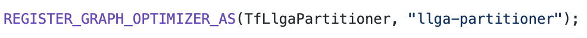
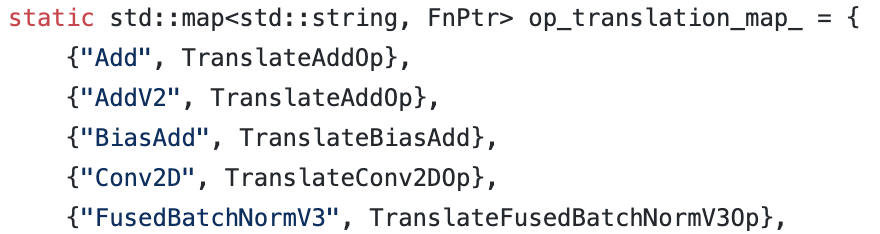
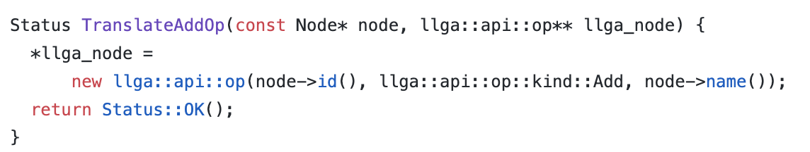
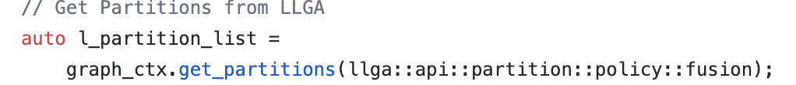
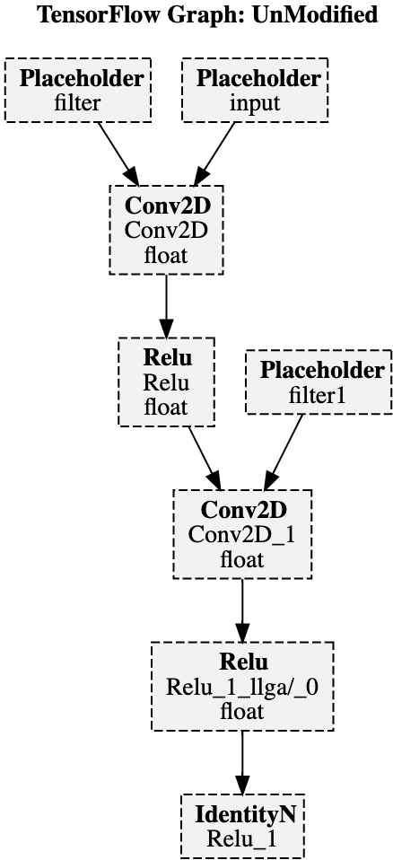
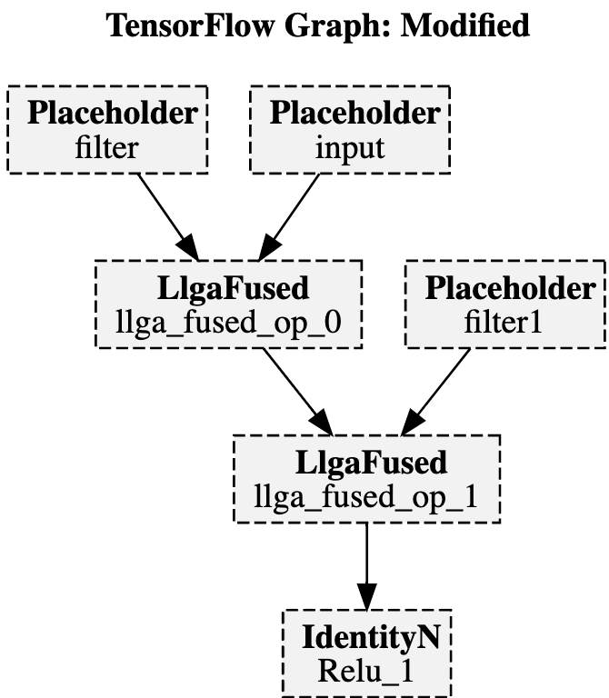
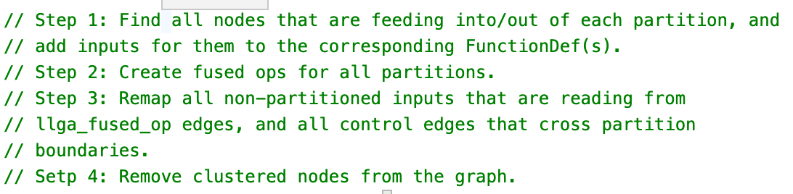
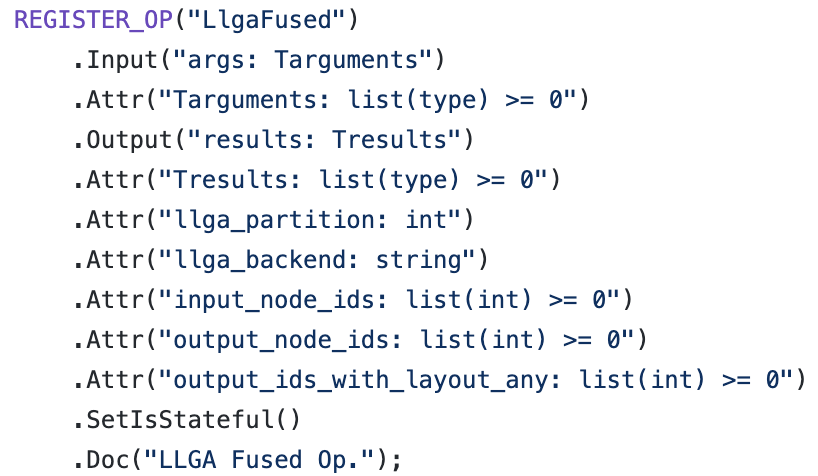
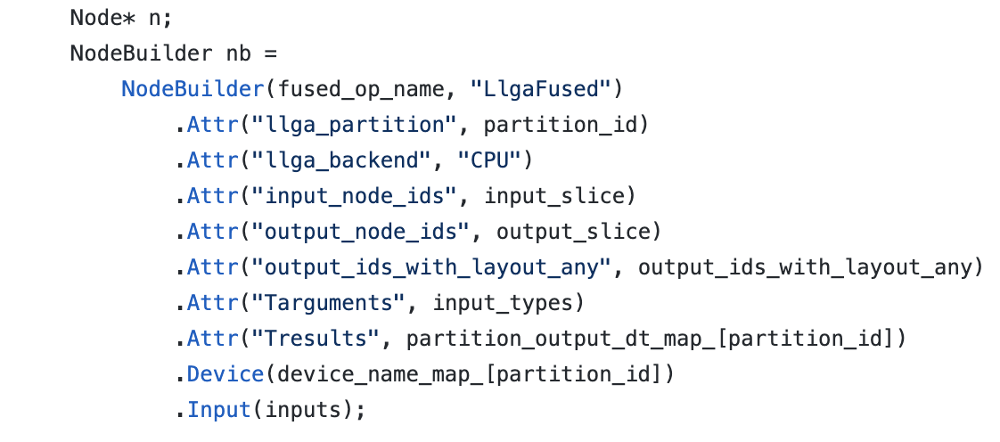
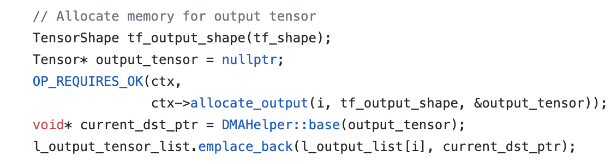

# TF-oneDNNGraph bridge    (Not for Production Use)

*Disclaimer* - The purpose of this bridge is to showcase the ease of integration of oneDNNGraph into TensorFlow framework. It is NOT meant for production use. The production plans for this module will be announced in the future.

#### Build requirements

Install `cmake`, `virtualenv`, and `gcc 7.3` and `python3`.

##### Build TF-oneDNNGraph bridge

      1. Run cmake:
      	mkdir build; cd build; cmake ..
	  
      2. Make and install:
            make install
		 
	  Note: If you change the source, you have to run `make install` to
            update the virtualenv with your changes.
	  
      Make install, installs tensorflow and tf-onednngraph-bridge to a
      virtaulenv in build called tfenv. 
      
      3. Source the virtualenv:
            source tfenv/bin/activate

##### Run tests
      Examples are available in the examples directory. 
      After activating the virtualenv, run tests in tfenv:
           python examples/conv_relu.py

##### CMAKE FLAGS:

      1. DEFAULT_TF_VERSION_ENABLE=OFF
            TensorFlow version will be set to 1.14. The default is 2.2
	 
### Tensorflow oneDNN Graph Integration Guide
      The integration module is a customized grappler pass in Tensorflow
      which traverses and optimizes the graph with oneDNN graph fusions.

#### 1. Hooking into Tensorflow Framework (TF) (__init__.py, partitioner.cc)
      The entry from TF into the integration module is through a registered customized
      grappler pass.The integration module is a separate dynamic library which links
      directly to a prebuilt TF version (2.2 default), requiring no change in TF code
      repository.

#### 2. Graph Traversal, Optimization & Rewrite (partitioner.cc, replace_fusions.cc)
      Once we are inside the integration module, the integration module goes over all the ops
      in the TF graph, checks if there is an equivalent oneDNN Graph op, if there is one,
      it translates the TF op to oneDNN Graph op and if there is no corresponding oneDNN Graph
      op then that op will be passed as a wildcard op.

      The oneDNN Graph then has its own internal graph IR based on all the ops being 
      translated and it optimizes the graph based on all the available fusion capabilities.
      oneDNN Graph provides a “get_partitions'' API which traverses its internal graph and
      returns all the possible fusions back to the integration module.

      The integration module iterates over all the partitions returned by oneDNN Graph,
      creates custom TF ops encapsulating those fusions and rewrites the original framework
      graph to replace the fusions with custom TF ops. The graph is now a mix of both TF ops
      and custom ops (which will be executed through oneDNN Graph backend).

  

      Each Partition corresponds to one custom TF op in the graph.

#### 3. Execution: (llga_fused_op.cc)

      At TF runtime, the partitions are compiled by oneDNN Graph. The output tensor’s memory is 
      thereafter allocated and the partition/stream is submitted for execution. TF-oneDNN Graph
      integration module gives us good Out of the Box TF performance on CPU. Adding new 
      fusions/optimizations require zero to minimal change in the integration module 
      and no change in the TF code repository. 
